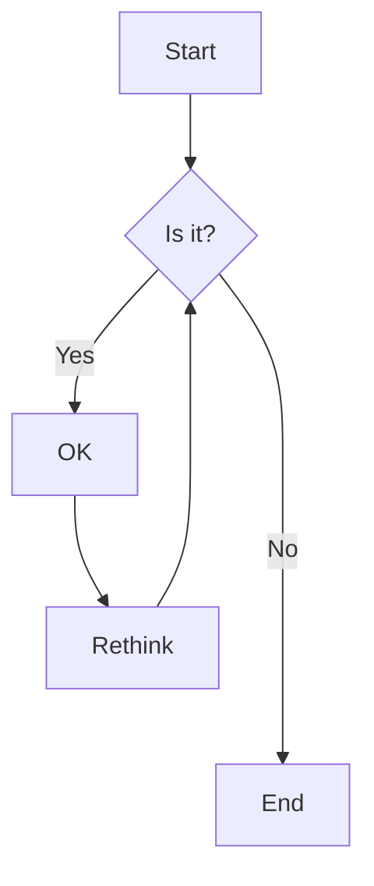
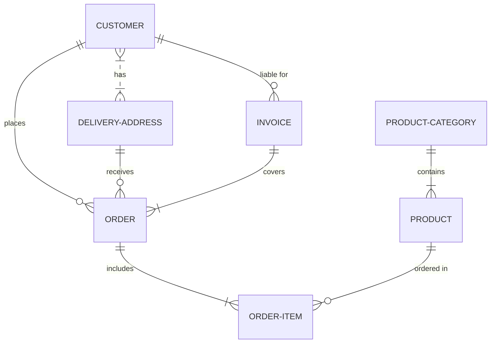

# markdown_learn

## this is H2
###### this is H6

**这是加粗**
__这也是加粗__
*这是倾斜*
_这也是倾斜_
***这是加粗倾斜***
~~这是加删除线~~

# 这是引用：
> This is a blockquote with two paragraphs. Lorem ipsum dolor sit amet,
> consectetuer adipiscing elit. Aliquam hendrerit mi posuere lectus.
> Vestibulum enim wisi, viverra nec, fringilla in, laoreet vitae, risus.
>
> Donec sit amet nisl. Aliquam semper ipsum sit amet velit. Suspendisse
> id sem consectetuer libero luctus adipiscing.

# 无序列表：
- 列表内容
+ 列表内容
* 列表内容
  
注意：- + * 跟内容之间都要有一个空格

## 有序列表：
1. 列表内容
2. 列表内容
3. 列表内容

注意：序号跟内容之间要有空格

## 嵌套列表：
* 一级无序列表内容

   * 二级无序列表内容
   * 二级无序列表内容
   * 二级无序列表内容
      * 三级无序列表

# 代码的缩进
*   Lorem ipsum dolor sit amet, consectetuer adipiscing elit.
    Aliquam hendrerit mi posuere lectus. Vestibulum enim wisi,
    viverra nec, fringilla in, laoreet vitae, risus.
*   Donec sit amet nisl. Aliquam semper ipsum sit amet velit.
    Suspendisse id sem consectetuer libero luctus adipiscing

# 代码块：
这是一个普通段落：

    这是一个代码区块。

(前面要有一个空行和前面的文字分隔开)

这里有一句代码`int i;`。

```c
int main(){
    printf("Hello world");
    return 0;
}
```

# 流程图



# TeX & LaTeX 公式
## 行内公式用$
勾股定理： $a^2 + b^2 = c^2$.
## 行间公式用$$
毕达哥拉斯定理:
$$
\begin{equation}
a^2 + b^2 = c^2 \tag{1.1}
\end{equation}
$$
> ***公式 (1.1) 在中国被称为勾股定理***.
## 行高
行内公式: $\lim_{n \to \infty}
\sum_{k=1}^n \frac{1}{k^2}
= \frac{\pi^2}{6}$.

行间公式:
$$
\lim_{n \to \infty}
\sum_{k=1}^n \frac{1}{k^2}
= \frac{\pi^2}{6}
$$
证明相关：
$$\begin{align}
\because a \ge b \\ b \ge c \\ \therefore a \ge c
\end{align}$$

~~规则太多了抄不完（bushi）~~

写一个个人最喜欢的：

$$
e^{i\pi}+1 = 0
$$
