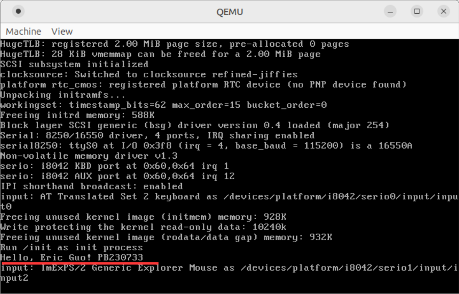
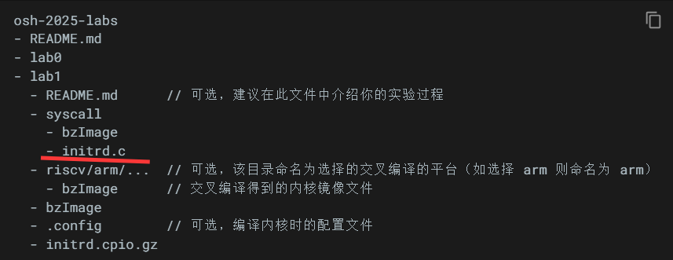

# Linux 编译

AI给我的对于大小的影响排序如下：
1. **Enable loadable module support**
2. **Virtualization**
3. **Networking support**
4. **File systems**
5. **Security options**
6. **Cryptographic API**
7. **Device Drivers**
8. **Memory Management options**
9. **Processor type and features**

---

我个人感觉比较占地方的是：
1. **调试相关的，这个我感觉最占地方**
2. **网络**
3. **虚拟化**
4. **驱动**
5. **文件系统**
6. **内存管理**
7. **模块化支持里面的没用的模块**

## The first time

我裁剪了很多，最后出来的bzImage有4.0M，编译过程中我看到了有很多没用drivers，~~感觉还是有些没裁掉（暴论）~~

用 `qemu` 运行的时候报了个错，`gtk initialization failed`，像是手快卸 `drivers` 卸多了呜呜呜

## The second time

怎么还有这个错误，是没安装gtk库？还有DISPLAY环境变量？重新试一下。

## The third time

这次终于好了，~~大胜利呜呜呜~~，这次是3.3M。

用 `Windows ssh` 上用 `qemu` 是没有GUI的，得网页桌面登录虚拟机，这下都看到了。

## 将`while (1) {}`删去之后会使编译的内存盘 `kernel panic` 的原因

`init` 是系统中的第一个用户态进程，内核启动后，会寻找并运行 `init` 程序作为第一个用户态进程。`while (1) {}` 让 init 进程保持运行状态，不会退出。

如果删除 `while (1) {}`，`main()` 函数会执行完毕并返回，导致 `init` 进程退出，内核会认为系统无法继续运行，从而触发 `kernel panic`。

## 第三小节的自定义系统调用

按照文件里给的步骤，发现编译出来的内核貌似压根没跑我写的initrd，问了一圈子才发现打包 `initrd` 的命令 `find . | cpio --quiet -H newc -o | gzip -9 -n > ../initrd.cpio.gz`它不认 `initrd` ，它只认 `init.c` 和 `init` ，但是助教文件里给的是 `initrd.c`

**~~啊啊啊可恶的助教误导我（bushi）~~**

## 总结

总而言之言而总之算是做完了，但是仓库结构可能跟助教的模板不太一样，不过任务倒是一个不落都完成啦，开心捏。

哦对了，2025.3.22发布的是linux-6.13.8，所以我用的就是这个了。